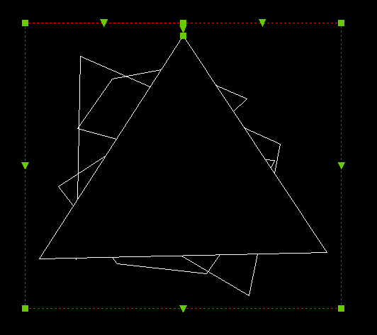

tags:: DXF-Internals

- [DXF Reference](https://help.autodesk.com/view/OARX/2018/ENU/?guid=GUID-34F179D8-2030-47E4-8D49-F87B6538A05A)
- This object is used to describe the clipping path for [[XREF]] and [[BLOCKS]] create by the [[XCLIP]] command
- The SPATIAL_FILTER object is attached to the [[INSERT]] entity via the [[Extension Dictionary]]
- The entity is supported from [[DXF R2000]] onwards
-
- ## Clip Boundary Geometry
	- The group code 10 tags define the clipping boundary in [[OCS]] coordinates based on an xref scale of 1
	- The [[OCS]] of the boundary path is defined by group code 210, the  `extrusion vector`
		- All examined samples have an `extrusion` vector of (0, 0, 1)
	- The group code 11 is used to define the `origin` of the local coordinate system of the clip boundary
		- All examined samples have an `origin` of (0, 0, 0)
		- This is maybe just the elevation value stored in the z-axis like in the [[POLYLINE]] entity
	- As the name implies - this is a 3D object. The spatial boundaries are defined by the front- and back clipping planes.
		- Group code 40 defines the `front_clipping_plane_distance` (from the `origin` in direction of the `extrusion vector`)
		- Group code 41 defines the `back_clipping_plane_distance` (from the `origin` in direction of the `extrusion vector`)
		- **Important:**
			- The group codes 40 and 41 should not be written if front- or back clipping is disabled
				- [[AutoCAD]] doesn't like that
	- In all examined samples created by [[BricsCAD]] was the OCS of boundary path aligned with the coordinate system of the block definition.
	- The clipping path doen't have to be closes (first vertex != last vertex).
	- Two vertices define a rectangle/cuboid where the sides are parallel to the x-, y- an z-axis.
	- The clipping path is the geometry entered via the [[XCLIP]] command in OCS coordinates  (=WCS in most cases).
	- The boundary vertices are transformed into block coordinates by applying the `inverse_insert_matrix`.
	-
- ## Inverted Clip Boundary
	- There is no flag to indicate an `inverted` clipping boundary
	- The regular clipping clipping path, the outer triangle
	- 
	- The inverted clipping path, the inverted clipping path in red
	- 
	- The triangle itself is not included in the SPATIAL_FILTER entity anymore, instead the SPATIAL_FILTER entity got an extension dictionary:
	- 
	- 
	- This extension dictionary has an entry `ACAD_XREC_ROUNDTRIP` that references a [[XRECORD]] which has all the required information:
	- 
-
- ## Stored Transformation Matrices
	- The [[SPATIAL_FILTER]] entity includes two transformation matrices
		- `inverse_insert_matrix`
			- This is the inverse of the original block reference transformation.
			- The original block reference transformation is the one that is applied to all entities in the block when the block reference is regenerated.
		- `transform_matrix`
			- This matrix transforms points into the coordinate system of the clip boundary
		-
- ## Transformation
	- [[Exploring the transformation behavior of SPATIAL_FILTER]]
	- The [[SPATIAL_FILTER]] object has to be transformed along with the [[INSERT]] entity
		- What attributes have to be transformed?
			- None so far!
			- `origin` is always (0, 0, 0) and remains always (0, 0, 0) in the cases I investigated
			- The boundary vertices remain at the original location as the boundary path was entered via the [[XCLIP]] command.
			- `ACAD_XREC_ROUNDTRIP` - not tested but I am sure they behave like the boundary path vertices - so nothing to do
			- `inverse_insert_matrix` is not changed
			- `transformation_martix` is not changed
		- A test of copying clipped block references by `ezdxf` (created by BricsCAD) already works after implementing the SPATIAL_FILTER entity and without applying any additional transformations in the [[INSERT]].
-
- ## Creating the boundary path in BLOCK coordinates
	- the `inverse_insert_matrix` is the identity matrix
	- `transformation_matrix` is the identity matrix
	- `origin` is (0, 0, 0)
	- `extrusion` is (0, 0, 1)
-
- ## Creating the boundary path in WCS coordinates
	- Transform boundary vertices into [[OCS]] coordinates
	- the `inverse_insert_matrix` is the inverse of the [[INSERT]] matrix
	- `transformation_matrix` is the identity matrix
	- `origin` is (0, 0, 0)
	- `extrusion` is the `extrusion` vector of the [[INSERT]] entity