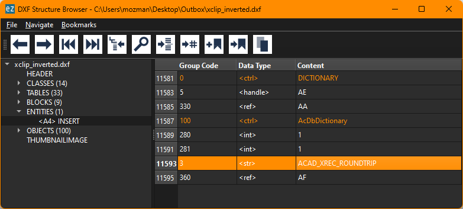

tags:: DXF-Internals

- [DXF Reference](https://help.autodesk.com/view/OARX/2018/ENU/?guid=GUID-34F179D8-2030-47E4-8D49-F87B6538A05A)
- This object is used to describe the clipping path for [[XREF]] and [[BLOCKS]] create by the [[XCLIP]] command
- The SPATIAL_FILTER object is attached to the [[INSERT]] entity via the [[Extension Dictionary]]
- The entity is supported from [[DXF R2000]] onwards
-
- ## Clip Boundary Geometry
	- The group code 10 tags define the clipping boundary in [[OCS]] coordinates based on an xref scale of 1
	- The [[OCS]] is defined by group code 210, the  `extrusion vector`
		- Q: Can this extrusion vector differ from the extrusion vector of the parent [[INSERT]] entity?
	- The group code 11 is used to define the `origin` of the local coordinate system of the clip boundary
		- I guess in WCS coordinates
	- As the name implies - this is a 3D object. The spatial boundaries are defined by the front- and back clipping planes.
		- Group code 40 defines the `front_clipping_plane_distance` (from the `origin` in direction of the `extrusion vector`)
		- Group code 41 defines the `back_clipping_plane_distance` (from the `origin` in direction of the `extrusion vector`)
-
- ## Inverted Clip Boundary
	- There is no flag to indicate an `inverted` clipping boundary
	- The regular clipping clipping path, the outer triangle
	- 
	- The inverted clipping path, the inverted clipping path in red
	- 
	- The triangle itself is not included in the SPATIAL_FILTER entity anymore, instead the SPATIAL_FILTER entity got an extension dictionary:
	- 
	- 
	- This extension dictionary has an entry `ACAD_XREC_ROUNDTRIP` that references a [[XRECORD]] which has all the required information:
	- 
-
- ## Stored Transformation Matrices
	- The [[SPATIAL_FILTER]] entity includes two transformation matrices
		- `inverse_insert_matrix`
			- This is the inverse of the original block reference transformation.
			- The original block reference transformation is the one that is applied to all entities in the block when the block reference is regenerated.
		- `transform_matrix`
			- This matrix transforms points into the coordinate system of the clip boundary
		-
- ## Transformation
	- The [[SPATIAL_FILTER]] object has to be transformed along with the [[INSERT]] entity
		- What attributes have to be transformed?
			- origin
			- boundary vertices
			- `ACAD_XREC_ROUNDTRIP`
		- What attributes can be ccopied from the [[INSERT]] entity?
			- extrusion vector
		- How to create or transform the transformations matrices?
	-